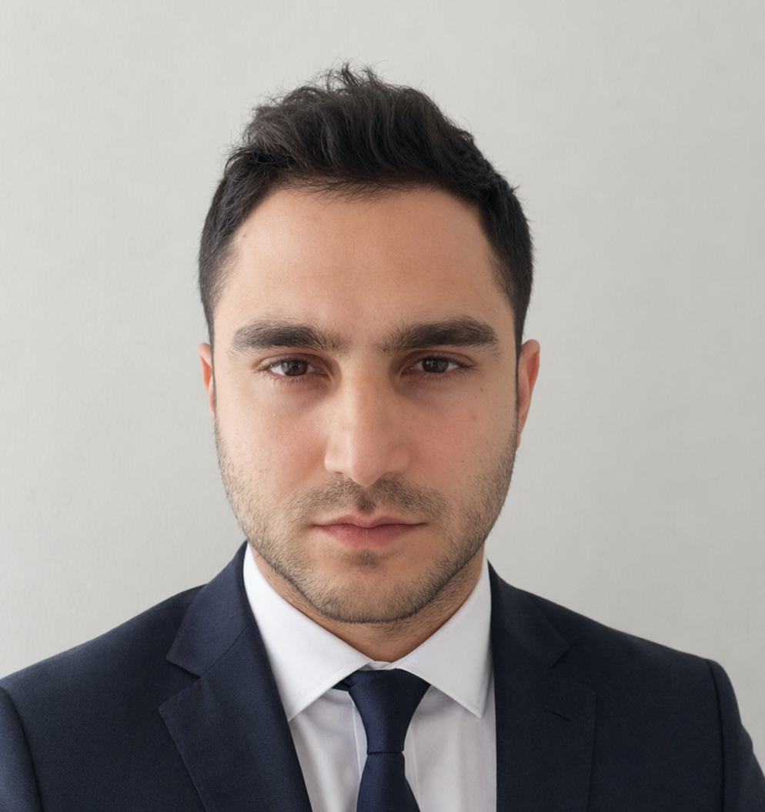

  

# AHMET YESEVI TURKER

📞 +90 531 280 9599  
📧 yesevi.turker@gmail.com  
📍 Istanbul, Turkey

---

# INFORMATION

**Date of Birth:** 23.03.1993

**Nationality:** Turkey

**Military Service:** Fulfilled

---

# EDUCATION

## Istanbul Technical University

**MSc Business Administration and Technology Management**

2026 - Present

---

## Sakarya University

**MSc Biomedical Engineering**

2016 - 2018

Overall GPA: **4.0 / 4.0**

---

## Sakarya University

**BSc Electrical & Electronics Engineering**

2011 - 2016

Overall GPA: **3.6 / 4.0**

---

## Bahçelievler Cumhuriyet Anadolu High School

Science Department

2007 - 2011

---

# EXPERIENCE

## Ceva Logistics - CMA CGM

### Lead of Data Science & Artificial Intelligence

December 2025 - Present

Leading the design, development, and deployment of enterprise-scale Artificial Intelligence and Data Science solutions, transforming complex business challenges into scalable, production-ready systems.

Experienced in machine learning, deep learning, advanced analytics, computer vision, recommendation systems, optimization, and Generative AI technologies.

Proven expertise in building high-performance AI platforms, integrating intelligent systems into enterprise architectures, and delivering measurable business value through data-driven innovation.

Strong background in cloud-native environments, distributed systems, and scalable AI services leveraging both synchronous and asynchronous communication frameworks.

---

## Borusan Logistics

### Lead of Artificial Intelligence & Advanced Analytics

January 2022 - December 2025

Leading the full lifecycle of data science and AI initiatives from data extraction and preprocessing to model development, validation, and deployment.

Proficient in a wide range of machine learning, deep learning, statistical modeling, and optimization techniques.

Experienced in computer vision, advanced analytics, recommendation systems, and optimization algorithms.

Skilled in Generative AI and AI agent development.

Strong expertise in data quality assessment, feature engineering, and integrating AI systems into enterprise-level platforms to drive operational efficiency, cost optimization, and decision-making accuracy.

Experienced in cloud infrastructures, synchronous and asynchronous communications (REST API, Service Bus), and delivering AI as a Service (AIaaS) solutions.

---

## Baykar Technologies

### Team Lead of Signal Processing and Machine Learning

October 2018 - July 2021

Led the end-to-end development and deployment of advanced Signal Processing, Machine Learning, and Artificial Intelligence solutions for aerospace and autonomous systems.

Directed multidisciplinary teams throughout the full project lifecycle, including requirements analysis, algorithm design, model development, embedded deployment, system integration, verification, and real-world flight testing.

Specialized in time-series analytics, anomaly detection, event classification, predictive modeling, and autonomous decision-support systems.

Possess strong expertise in frequency-domain analysis, feature extraction, hybrid AI and rule-based architectures, and the development of data-driven physical models for complex non-linear systems.

Experienced in optimizing AI models for embedded GPU platforms through NVIDIA TensorRT, enabling real-time inference in mission-critical environments.

Proficient in integrating AI capabilities into avionics and embedded systems, conducting simulation-based validation, hardware-in-the-loop testing, and operational flight trials.

---

### Team Lead of Software Project Management

July 2020 - July 2021

Responsible for coordinating project managers in the Artificial Intelligence department.

Created Baykar Artificial Intelligence System standards, procedures, technical documents, business plans, and Agile Kanban management systems.

---

## Sakarya University

### Teaching Assistant

November 2016 - June 2018

Teaching Assistant for Statistics & Probability and Signals & Systems courses.

Participated in examination preparation and evaluation.

Guided undergraduate students in their projects.

---

# TECHNICAL STRENGTHS

| Area | Technologies |
|--------|--------|
| Artificial Intelligence | Machine Learning, Deep Learning, Generative AI, AI Agents |
| Programming | Python, C, C++, C#, MATLAB |
| Optimization | OR-Tools, Heuristic Models |
| Signal Processing | FFT, STFT, Wavelet Transform, Digital Filters |
| Cloud | Azure, AWS |
| Integration | REST APIs, Service Bus |
| Tools | Docker, Git, SQL, NoSQL, Jira, n8n |

---

# PROJECTS

## Design of Embedded System-Based ECG Holter Device and Detection of Arrhythmia by Artificial Neural Network - Genetic Algorithm Hybrid Model

Designed and developed an intelligent embedded healthcare system for continuous ECG monitoring and automated arrhythmia detection integrating advanced signal processing, machine learning, and optimization techniques.

---

## Development of a Multi-Irradiation Modulated Photodynamic Therapy Laser System

TUBITAK 1005 Project

Worked on electronic circuit design, PID laser temperature control, laser system setup, testing, and validation.

---

## Design of a Micro-Computer Based Real-Time ECG Holter Device and Real-Time Analysis

TUBITAK 2209/B Project

Architected and developed an embedded biomedical monitoring platform for real-time ECG acquisition and analysis.

---

## National Ventilator Development Consortium

Biosys Ventilator

Contributed to software engineering, signal processing, system verification, validation, and industrialization activities during the COVID-19 pandemic.

---

# PUBLICATIONS

- AI-Driven Risk Management in Logistics — DOI: 10.5281/zenodo.18399343
- Pedestrian Equipment Anomaly Detection with Computer Vision — DOI: 10.11159/mvml24.110
- Address Singularization with Text Similarity Algorithms — DOI: 10.33422/4th.worldcme.2023.10.100
- Dynamic Freight Pricing By Artificial Intelligence — DOI: 10.37904/clc.2023.4859
- Less Than Truckload Hub Network Design — DOI: 10.37904/clc.2022.4526
- Design of Embedded System Based ECG Holter Device — DOI: 10.21541/apjes.335275
- Detection of Candidate Nodules in Lung Tomography — DOI: 10.1109/BIYOMUT.2017.8478990

---

# PATENTS

- Domestic Partial Distribution Network Modeling (2022)
- Dynamic Freight Price Forecasting (2023)

---

# HONORS

- Best AI Transformation and Implementation Award (2024)
- Highest Ranked Student in Institute of Science and Technology (2018)
- Highest Ranked Student in Biomedical Engineering Department (2018)
- Highest Ranked Student in Technology Faculty (2016)
- Highest Ranked Student in Electrical & Electronics Engineering Department (2016)
